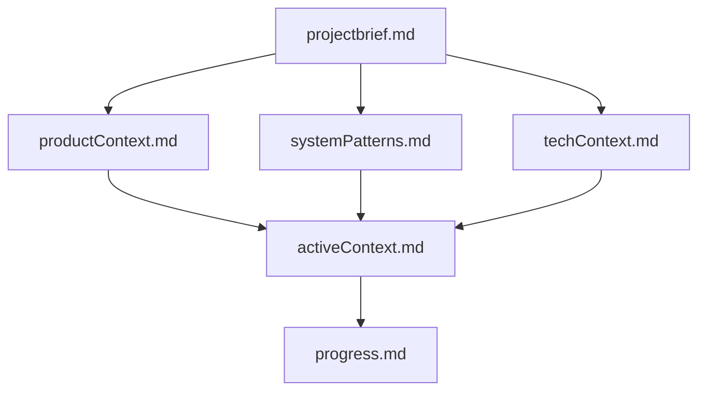

# Memory Bank: bitcoin.rocks

This memory bank contains comprehensive documentation for the bitcoin.rocks project. It serves as the primary knowledge repository for understanding the project's context, architecture, and current state.

## Purpose

The memory bank is designed to provide complete project context for anyone working on bitcoin.rocks, whether they're new contributors, returning developers, or AI assistants. It captures the essential knowledge needed to understand and contribute effectively to the project.

## File Structure

### Core Files (Required)
These files form the foundation of project understanding and should be read in order:

1. **[projectbrief.md](projectbrief.md)** - Foundation document defining project scope, mission, and objectives
2. **[productContext.md](productContext.md)** - Why the project exists, user journeys, and experience goals
3. **[systemPatterns.md](systemPatterns.md)** - Technical architecture, design patterns, and system organization
4. **[techContext.md](techContext.md)** - Technology stack, development setup, and technical constraints
5. **[activeContext.md](activeContext.md)** - Current work focus, recent changes, and immediate priorities
6. **[progress.md](progress.md)** - What works, what's left to build, and current project status

### File Relationships

## How to Use This Memory Bank

### For New Contributors
1. Start with `projectbrief.md` to understand the project's mission and scope
2. Read `productContext.md` to understand user needs and experience goals
3. Review `systemPatterns.md` and `techContext.md` for technical understanding
4. Check `activeContext.md` for current priorities and work focus
5. Consult `progress.md` to understand what's complete and what needs work

### For Returning Contributors
1. Check `activeContext.md` for recent changes and current priorities
2. Review `progress.md` for updated project status
3. Refer to other files as needed for specific context

### For AI Assistants
1. Read ALL memory bank files at the start of EVERY session
2. Use this documentation to understand project context and make informed decisions
3. Update memory bank files when significant changes or discoveries are made
4. Maintain accuracy and completeness of all documentation

## Maintenance Guidelines

### When to Update
- **Major feature additions or changes**
- **Significant architectural decisions**
- **Changes in project priorities or focus**
- **Completion of major milestones**
- **Discovery of new project patterns or insights**

### Update Process
1. **Review ALL files** when updating (don't just update one file in isolation)
2. **Maintain consistency** across all files
3. **Update related files** when making changes (e.g., if activeContext.md changes, progress.md may need updates too)
4. **Keep information current** and remove outdated information
5. **Preserve historical context** where relevant for decision-making

### Quality Standards
- **Accuracy**: All information must be current and correct
- **Completeness**: Cover all essential aspects of the project
- **Clarity**: Write for someone completely new to the project
- **Consistency**: Maintain consistent terminology and structure
- **Actionability**: Provide concrete, actionable information

## Project Context Summary

**bitcoin.rocks** is a Bitcoin education website founded in 2022 with the mission to accelerate Bitcoin adoption through education. Key characteristics:

- **Static site architecture** (HTML/CSS/JS, no CMS)
- **Multi-language support** via jquery.i18n
- **Community-driven** open source project
- **Beginner-focused** educational content
- **Topic-based organization** covering Bitcoin's impact areas
- **Physical resources** (stickers, postcards, business kits)

## Related Documentation

- **[.clinerules](.clinerules)** - Project-specific patterns and intelligence
- **[README.md](../README.md)** - Main project README
- **[CONTRIBUTING.md](../CONTRIBUTING.md)** - Contribution guidelines
- **[LICENSE.md](../LICENSE.md)** - MIT license information

## Memory Bank Version

**Created**: 2025-06-20  
**Last Updated**: 2025-06-20  
**Version**: 1.0  
**Status**: Complete initial version

This memory bank provides a comprehensive foundation for understanding and contributing to the bitcoin.rocks project.
